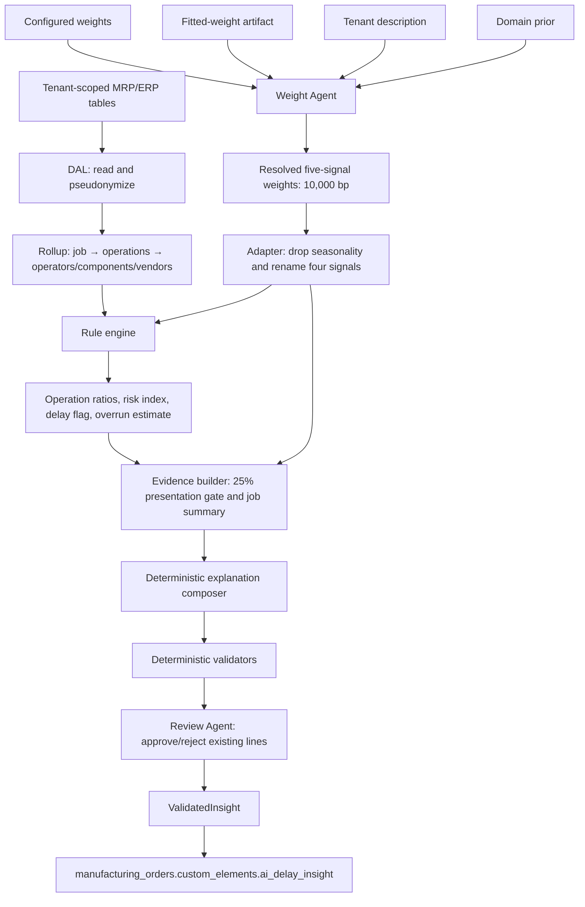

# M3 Production Delay Predictor — Model Logic

Status: implementation baseline as of 23 September 2026

## 1. Purpose and scope

M3 is an advisory production-delay pipeline. It does not contain one trained
probability model. The current implementation is a composition of:

1. a deterministic data rollup;
2. a Weight Agent that selects tenant-specific signal weights;
3. a deterministic rule engine that calculates operation-level ratios and an
   unbounded composite score;
4. a deterministic explanation composer and validator; and
5. a Review Agent that judges already-composed explanation lines.

The implementation therefore produces a **risk index relative to a threshold**,
not a calibrated probability of delay. A score of `2.0` against a threshold of
`1.0` means approximately 200% of the threshold; it does not mean a 200%
probability.

This document describes executable behavior. Requirements coverage and gaps are
tracked separately in [m3-model-logic-vs-user-story.md](m3-model-logic-vs-user-story.md).

## 2. End-to-end flow



The source workflow diagrams are
[m3_workflow.mmd](../modules/m3_production_delay/m3_workflow.mmd) and
[m3_file_execution_order.mmd](../modules/m3_production_delay/m3_file_execution_order.mmd).

## 3. Data acquisition and rollup

### 3.1 Tenant isolation and operator privacy

`read_delay_tables(tenant)` reads each table through the shared tenant-scoped
data-access layer. Raw operator identifiers are HMAC-pseudonymized before the
data leaves the DAL.

Primary inputs include:

- manufacturing orders and work orders;
- operation dependencies and work centres;
- work-order time logs;
- MO components and item availability;
- item vendors, purchase orders, PO lines, and GRNs.

See [rule_engine/dal.py](../modules/m3_production_delay/rule_engine/dal.py).

### 3.2 Job rollup

`build_job_rollups()` constructs this logical shape:

```text
job
└── operations[]
    ├── expected and actual duration
    ├── quantity and units done
    ├── predecessor work-order ids
    ├── assigned operators[]
    │   └── last 10 work orders with scheduled/elapsed minutes
    └── components[]
        ├── required and available quantity
        └── vendor
            └── last 10 purchase orders
```

Important implementation details:

- predecessor dependencies are defined at BOM-operation level and translated
  to work-order IDs for the same manufacturing order;
- operator elapsed time comes from that operator's time logs, not the combined
  work-order duration;
- PO order date is approximated by `sent_at`, falling back to `created_at`;
- GRN receipt time is approximated by a qualifying GRN's `updated_at`;
- the first matching item vendor is used because no primary-vendor flag is
  available in the local schema subset.

See [rule_engine/rollup.py](../modules/m3_production_delay/rule_engine/rollup.py).

## 4. Weight Agent

### 4.1 Responsibility

The Weight Agent chooses the relative importance of five tenant-level signals.
It does not calculate the operation's risk score.

```text
time_overrun
operator_skill
seasonality
material_availability
supplier_reliability
```

All weight vectors use integer basis points:

```text
100 bp = 1 percentage point
10,000 bp = 100%
```

### 4.2 Domain prior and bounds

| Signal | Prior | Allowed final range |
|---|---:|---:|
| Time overrun | 4,000 bp (40%) | 3,000–5,000 bp (30–50%) |
| Operator skill | 3,500 bp (35%) | 2,000–4,500 bp (20–45%) |
| Seasonality | 1,000 bp (10%) | 500–2,000 bp (5–20%) |
| Material availability | 1,000 bp (10%) | 500–2,500 bp (5–25%) |
| Supplier reliability | 500 bp (5%) | 300–1,500 bp (3–15%) |

These are product-configured policy values in
[weight_agent/config.py](../modules/m3_production_delay/llm_agents/weight_agent/config.py),
not weights learned from production outcomes.

### 4.3 Resolution priority

The resolver evaluates sources in this order:

1. **Configured:** a complete, in-bounds tenant vector totaling 10,000 bp.
   This is returned as `source=configured`, `status=active`.
2. **Historical fitted/blended:** a valid fitted artifact for the exact current
   signal set, with sufficient delayed-event evidence.
3. **LLM-adjusted prior:** two LLM calls classify the tenant and propose a
   bounded, sum-to-zero adjustment.
4. **Prior:** the effective domain prior is returned when no higher route is
   usable.

All non-configured results are recommendations and set
`requires_admin_approval=True`. Resolution itself does not persist approval.

See [weight_agent/resolver.py](../modules/m3_production_delay/llm_agents/weight_agent/resolver.py).

### 4.4 Availability

For non-configured routes, unavailable signals are fixed at zero. Their prior
share is redistributed across available signals so the vector still totals
10,000 bp. Bounds are scaled as part of the same operation. If no signal is
available, the resolver raises `AllSignalsUnavailableError`.

### 4.5 Historical fitted-weight route

Current-history metadata is classified as:

- `inadmissible`;
- `usable_weak`;
- `sufficient`; or
- `preferred`.

Default sufficiency expectations are 180 days, 500 completed work orders, 50
delayed work orders, and 80% per-signal coverage. A preferred history spans at
least 365 days.

The hard usable floor depends on the fitted artifact's signal count:

```text
free_parameters = max(0, available_signal_count - 1)
n_floor = 10 × free_parameters
effective_n = max(0, fitted_delayed_events - n_floor)

lambda = 0                                      when effective_n = 0
lambda = effective_n / (effective_n + 40)       otherwise
```

The blend is:

```text
final_weight_i = lambda × fitted_weight_i
               + (1 - lambda) × prior_weight_i
```

The fitted artifact's own delayed-event count controls its influence. The
request's current `HistoryInputs` are audit/UI metadata and do not train a
model or create a fitted artifact.

The shipped provider is `NullFittedWeightsProvider`; therefore production
history does not affect weights until a real fitting pipeline, artifact store,
and provider are added. See
[weight_agent/providers.py](../modules/m3_production_delay/llm_agents/weight_agent/providers.py)
and [weight_agent/blend.py](../modules/m3_production_delay/llm_agents/weight_agent/blend.py).

### 4.6 LLM cold-start route

Tenant description lookup uses the first available source:

```text
x-tenant-description request header → metadata provider → local tenet_data.yml
```

The metadata provider currently defaults to a null implementation.

The LLM route has two stages:

1. **Profile extraction:** raw description is converted into closed-vocabulary
   fields such as production type, material dependency, supplier dependency,
   workforce dependency, and seasonality level. Confidence is the fraction of
   profile fields extracted, not an LLM-provided score.
2. **Weight adjustment:** only the validated profile, prior, and bounds are
   provided to the second call. It returns integer adjustments and evidence.

The adjustment prompt provides qualitative direction, for example:

- high material dependency generally increases material availability;
- unstable suppliers generally increase supplier reliability;
- manual or workforce-dependent production generally increases operator skill;
- moderate/high seasonality generally increases seasonality; and
- make-to-order or complex production may increase time overrun.

There is no fixed rule such as "high material dependency = +500 bp." The LLM
chooses the magnitude. The response must contain all five signals, integer
adjustments, and a sum of zero.

See [prompt/weight_adjustment.txt](../modules/m3_production_delay/prompt/weight_adjustment.txt).

### 4.7 Projection

Projection applies each proposed adjustment, clips final weights to their
bounds, then redistributes any residual according to remaining headroom until
the vector totals 10,000 bp. This deterministic layer, rather than the LLM,
enforces numeric safety.

See [weight_agent/projection.py](../modules/m3_production_delay/llm_agents/weight_agent/projection.py).

### 4.8 Adapter into the rule engine

The five Weight Agent values are divided by 10,000 and mapped as follows:

| Weight Agent signal | Rule-engine signal |
|---|---|
| `time_overrun` | `time_overrun_ratio` |
| `operator_skill` | `operator_pace_ratio` |
| `material_availability` | `material_shortfall_ratio` |
| `supplier_reliability` | `supplier_reliability` |
| `seasonality` | **Dropped: no rule-engine signal exists** |

The four remaining weights usually sum to less than 1.0. The composite-score
formula later renormalizes them over active signals.

## 5. Rule engine

### 5.1 Implemented signal formulas

#### Time overrun

```text
completion_fraction = current_done_quantity / job_quantity
time_overrun_ratio =
    actual_duration_minutes / (completion_fraction × expected_duration_minutes)
```

It is `None` when actual time is absent/zero, expected duration is zero, or
quantity progress is unavailable/zero.

#### Predecessor overrun

```text
predecessor_time_overrun_ratio = max(time_overrun_ratio of known predecessors)
```

This raw maximum is calculated for dependency context but is not included in
the base composite risk score.

The separate `critical_path.py` module runs Critical Path Method over the
operation dependency DAG using expected durations. It calculates earliest
and latest start/finish values and total float. An overrun above `1.20` is
allowed to propagate only through zero-float critical edges:

```text
critical_path_cascade_ratio = worst upstream critical-path ratio > 1.20

final_risk_score = max(
    critical_path_cascade_ratio,
    base_composite_risk_score + (critical_path_cascade_ratio - 1.0)
)
```

The second line uses the inherited ratio as a floor when the dependent has no
local evidence. Independent operations and non-critical branches receive no
cascade signal. A cyclic dependency graph safely disables cascade scoring for
that job and logs the invalid graph.

#### Operator pace

```text
operator_ratio = average(
    elapsed_time_minutes / scheduled_time_minutes
    over the operator's last 10 completed work orders
)

operator_pace_ratio = average(operator_ratio over assigned operators)
```

Operators with no usable completed history are excluded.

#### Material shortfall

```text
material_shortfall_ratio = sum(
    required_quantity / available_quantity
    for components where available_quantity < required_quantity
)
```

No short components produces `0.0`. Zero available stock produces infinity,
which is later sanitized by the Review layer before JSON publication.

#### Vendor lead-time ratio and supplier reliability

```text
vendor_lead_time_ratio = average(
    (grn_received_date - po_order_date)
    / (po_order_deadline - po_order_date)
    over usable received purchase orders
)

supplier_reliability = average(
    vendor_lead_time_ratio over operation components with usable vendors
)
```

Open POs without a GRN are excluded; this is historical received-PO behavior,
not a live overdue-open-PO signal.

### 5.2 Composite risk index

For all non-missing operation signals:

```text
weighted_sum = sum(weight_i × value_i)
active_weight_total = sum(weight_i)

base_composite_risk_score = weighted_sum / active_weight_total
composite_risk_score = apply critical-path cascade overlay, when present
is_delayed = composite_risk_score > delay_threshold
```

The default threshold in the rule-engine function is `1.0`, explicitly marked
in code as an uncalibrated placeholder. The production batch-review API
requires the caller to provide a threshold.

The score is unbounded because the inputs are unbounded ratios. It is not a
probability and is not clamped to `[0, 1]`.

### 5.3 Predicted overrun hours

Quantity-based estimate at completion is preferred when progress exists:

```text
predicted_total_minutes = actual_duration_minutes / completion_fraction
predicted_overrun_hours =
    (predicted_total_minutes - expected_duration_minutes) / 60
```

When no quantity progress exists, operator history is the fallback:

```text
predicted_total_minutes = expected_duration_minutes × operator_pace_ratio
predicted_overrun_hours =
    (predicted_total_minutes - expected_duration_minutes) / 60
```

An operation receives no estimate only when neither quantity progress nor
operator pace history is available.

See [rule_engine/elements.py](../modules/m3_production_delay/rule_engine/elements.py).

## 6. Review and explanation logic

### 6.1 Evidence and presentation gate

The rule engine calculates operation signals without a progress gate. The
Review layer exposes analysis only after combined Manufacturing Order
progress reaches 25%:

```text
MO progress =
  Σ(expected Work Order duration × clamp(units_done / quantity, 0, 1))
  ÷ Σ(expected Work Order duration)

analysis is eligible when MO progress >= 0.25
```

The gate is shared by every Work Order in the MO. Therefore, after the MO
crosses the milestone, a not-started dependent operation may surface a
validated critical-path cascade above `1.20`.

For scorable operations, the job summary uses:

```text
risk_score    = maximum operation composite score
overrun_hours = maximum operation predicted overrun
is_delayed    = any scorable operation delayed
summary_basis = "worst_operation"
```

“Total Estimated Delay” is therefore not a sum across serial operations.

### 6.2 Explanation fire baselines

| Signal | Explanation fires when | Composite weight |
|---|---:|---:|
| Time overrun | `> 1.0` | tenant weight |
| Operator pace | `> 1.2` | tenant weight |
| Material shortfall | `> 0.0` | tenant weight |
| Supplier reliability | `> 1.0` | tenant weight |
| Critical-path cascade | `> 1.2` | deterministic score overlay |
| Predecessor overrun | `> 1.2` | `0`; context only |

Only fired, score-changing, renderable signals become “Why the delay is
happening” lines. Lines are deterministic templates ordered by contribution.
The raw predecessor maximum remains context; only its CPM-validated cascade
counterpart changes the score and earns a visible reason.

### 6.3 Deterministic validation and LLM judge

Before the LLM is called, validators check signal firing, omissions, quoted
numbers, summary consistency, zero-weight visibility, unsupported cause words,
plausibility, no-fired-signal behavior, and predecessor context.

The Review Agent receives the evidence plus immutable candidate lines and
returns a verdict. It cannot author or edit a line. Unsupported lines may be
dropped and the remainder judged once more. If judgment still fails, the full
deterministic draft is published as `fallback_template` and audited.

Possible statuses are:

- `approved`;
- `approved_with_warnings`;
- `fallback_template`;
- `rejected`; and
- `suppressed_not_scorable`.

See [review/README.md](../modules/m3_production_delay/review/README.md).

## 7. Persistence and serving

Validated insight is merged into:

```text
manufacturing_orders.custom_elements.ai_delay_insight
```

Fallback, rejected, and not-scorable outcomes also create audit rows. The
Configurator exposes:

- `POST /api/{tenant}/models/m3_production_delay/batch-review` to score,
  review, and optionally persist; and
- `GET /api/{tenant}/delay-insights` to read cached insight.

The separate endpoints in `scripts/m3_demo_api.py`, including weight
configuration and immediate rescoring, are local demo infrastructure and must
not be interpreted as the production Tenant Admin workflow.

## 8. Worked example from the observed run

Resolved Weight Agent output:

```text
time_overrun           4,387 bp
operator_skill         3,387 bp
seasonality              778 bp
material_availability  1,148 bp
supplier_reliability     300 bp
```

After seasonality is dropped, the rule-engine weights total `0.9222`.

Observed values and contributions:

```text
2.6667 × 0.4387 = 1.16987
1.4000 × 0.3387 = 0.47418
1.3333 × 0.1148 = 0.15307
1.5000 × 0.0300 = 0.04500
                     --------
weighted sum          1.84211

risk score = 1.84211 / 0.9222 = 1.99752
```

Against threshold `1.0`, the frontend displays:

```text
round(1.99752 / 1.0 × 100) = 200% of delay threshold
```

The observed `+1.2 hrs` estimate came from operator pace:

```text
(180 minutes × 1.4 - 180 minutes) / 60 = 1.2 hours
```

It did not come from the already logged 480 minutes.

## 9. Implementation cautions

1. `risk_score` is not a probability despite the user-facing percentage.
2. `seasonality` consumes Weight Agent allocation but is discarded before
   scoring.
3. the rule engine has no scoring milestone; the normal 25% gate exists only
   in the Review layer, while a critical-path cascade may intentionally make
   a not-started dependent scorable;
4. current history inputs do not train weights; the shipped fitted provider
   always returns `None`;
5. Weight Agent recommendations are marked for approval, but production
   persistence/acceptance of those weights is not implemented here; and
6. job-level “Total Estimated Delay” is the maximum operation estimate, not a
   schedule-aware critical-path total.
